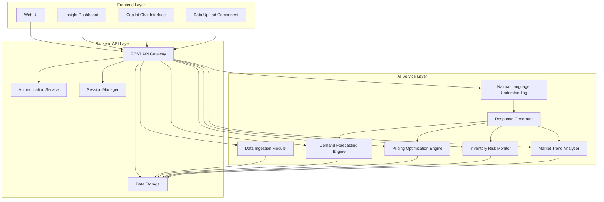

# Design Document: AI Retail Intelligence Copilot

## Executive Summary

The AI Retail Intelligence Copilot is an AI-powered decision-support system designed specifically for small ecommerce sellers, direct-to-consumer (D2C) founders, and marketplace vendors who need sophisticated business intelligence without enterprise-level complexity or cost. By combining conversational AI with modular analytics services, the copilot delivers pricing intelligence, demand forecasting, inventory risk alerts, and market trend insights through an intuitive interface that requires no technical expertise.

The system's core value proposition centers on explainable AI that transforms raw sales data into actionable recommendations. Rather than presenting black-box predictions, every insight includes clear explanations of the reasoning, confidence levels, and data limitations. This transparency empowers sellers to make informed decisions while understanding the basis for each recommendation.

Built with a modular architecture, the copilot orchestrates specialized services—Pricing Intelligence, Demand Forecasting, Inventory Monitoring, and Market Trend Analysis—through a conversational interface that interprets natural language questions and coordinates appropriate analyses. This design ensures practical business impact by meeting sellers where they are: asking questions about their business in plain language and receiving clear, trustworthy answers backed by data.

## Hackathon Scope and Assumptions

This design document describes a **hackathon prototype** of the AI Retail Intelligence Copilot. The following scope constraints and assumptions apply:

**Data Sources:**
- The prototype uses **synthetic datasets** or **publicly available sample data** to demonstrate functionality
- No real customer data or proprietary datasets are required
- Data generation modules create realistic sales patterns for demonstration purposes

**ML Components:**
- Machine learning components may use **simplified heuristics** or **lightweight statistical models** rather than production-grade deep learning
- Forecasting uses time series analysis with exponential smoothing rather than complex neural networks
- Pricing optimization uses elasticity estimation from historical patterns rather than reinforcement learning
- The focus is on demonstrating **explainable outputs** and **practical insights** rather than state-of-the-art accuracy

**Modular Architecture:**
- The Conversational Copilot serves as the **main interaction layer** that orchestrates specialized services
- Pricing, Forecasting, Inventory, and Trend Analysis components are **modular services** that can operate independently
- Some modules may be **partially simulated** in the prototype while maintaining realistic interfaces and outputs
- The architecture is designed to allow **incremental enhancement** of individual modules post-hackathon

**Scalability and Deployment:**
- The prototype targets **demonstration-level scalability** (hundreds of products, thousands of transactions)
- Performance benchmarks are appropriate for **single-user or small team usage**
- Deployment assumes **local or simple cloud hosting** rather than enterprise-scale infrastructure

**Explainability and Transparency:**
- All AI outputs include **clear explanations** of reasoning and confidence levels
- The system explicitly communicates **data limitations** and **assumption transparency**
- Judges can easily understand **how insights are generated** and **what data drives recommendations**

This scoping ensures the prototype is achievable within hackathon constraints while demonstrating the full vision of an intelligent, explainable, and practical decision-support system for small ecommerce sellers.

## Overview

The AI Retail Intelligence Copilot is a web-based decision-support system that combines conversational AI, predictive analytics, and visual dashboards to help small ecommerce sellers make data-driven business decisions. The system architecture follows a modular design with three primary layers: frontend (web UI), backend API, and AI services.

The system processes uploaded sales data through a data ingestion pipeline, applies machine learning models for forecasting and optimization, and presents insights through both a conversational interface and visual dashboard. All AI outputs include explanations to build user trust and understanding.

### Key Design Principles

1. **Modularity**: Each major capability (pricing, forecasting, trends, copilot) is an independent service with clear interfaces that can be developed and enhanced incrementally
2. **Explainability**: Every AI output includes reasoning, confidence levels, and transparent communication of limitations
3. **Simplicity**: User-facing language avoids technical jargon; the Conversational Copilot serves as the primary interaction layer
4. **Prototype-Appropriate Scalability**: Stateless API design supports demonstration-level usage with clear paths to production scaling
5. **Security**: Data isolation and encryption by default, with session-based data management

## Architecture

### High-Level Architecture



### Component Responsibilities

**Frontend Layer:**
- Web UI: Single-page application providing navigation and layout
- Dashboard: Visualizes metrics, trends, and alerts
- Chat Interface: Conversational UI for asking questions
- Upload Component: Handles file selection and upload progress

**Backend API Layer:**
- REST API Gateway: Routes requests to appropriate services
- Authentication Service: Manages user sessions (optional for hackathon)
- Session Manager: Maintains conversation context
- Data Storage: Persists uploaded data and analysis results

**AI Service Layer:**
- Data Ingestion Module: Validates, cleans, and structures uploaded data
- Demand Forecasting Engine: Predicts future sales using time series analysis (simplified statistical models for prototype)
- Pricing Optimization Engine: Recommends optimal prices based on elasticity estimation
- Inventory Risk Monitor: Detects stockout and overstock risks using forecasts and velocity analysis
- Market Trend Analyzer: Identifies emerging opportunities (uses synthetic trend data in prototype)
- Natural Language Understanding: Interprets user questions and routes to appropriate services
- Response Generator: Creates explainable natural language responses by orchestrating analysis modules

## Components and Interfaces

### 1. Data Ingestion Module

**Purpose:** Validate and process uploaded sales data into a standardized format.

**Input:**
- CSV file with columns: product_id, product_name, price, quantity, date, (optional: category, cost)

**Output:**
- Structured dataset with validated records
- Data quality report (missing values, invalid dates, outliers)
- Ingestion status (success/failure with details)

**Processing Steps:**
1. Validate file format and size limits
2. Check for required columns
3. Parse and validate data types (dates, numbers)
4. Handle missing values (flag or impute based on rules)
5. Detect and flag outliers
6. Calculate derived fields (revenue = price × quantity, day_of_week, month)
7. Store processed data with metadata

**Error Handling:**
- Missing required columns → Return error with list of missing fields
- Invalid date formats → Attempt common format parsing, flag unparseable rows
- Negative prices/quantities → Flag as warnings, allow user to review
- Empty file → Return error with guidance

### 2. Demand Forecasting Engine

**Purpose:** Generate future demand predictions for products using lightweight time series analysis.

**Input:**
- Historical sales data (product_id, date, quantity)
- Forecast horizon (default: 30 days)
- Product list (optional: forecast specific products)

**Output:**
- Daily demand predictions per product
- Confidence intervals (lower bound, upper bound)
- Explanation of key factors (trend, seasonality, recent changes)
- Data quality indicator (sufficient/insufficient historical data)
- **Transparent communication of model limitations and assumptions**

**Algorithm Approach:**
For the hackathon prototype, this module uses **simplified time series analysis** with exponential smoothing rather than complex neural networks. The focus is on **explainable outputs** and **practical insights** suitable for small business decision-making.

1. **Data Preparation:**
   - Aggregate sales by product and date
   - Fill missing dates with zero sales
   - Calculate rolling averages (7-day, 14-day)

2. **Trend Detection:**
   - Compute linear trend over historical period
   - Identify growth rate (increasing/stable/decreasing)

3. **Seasonality Detection:**
   - Detect day-of-week patterns
   - Identify recurring peaks (weekends, month-end)

4. **Forecast Generation:**
   - Apply exponential smoothing or simple moving average
   - Adjust for detected trend
   - Apply seasonal multipliers
   - Calculate confidence intervals based on historical variance

5. **Explanation Generation:**
   - Identify top factors: "Based on 15% weekly growth trend and weekend sales peaks"
   - Flag data limitations: "Limited to 20 days of history, confidence may improve with more data"

**Minimum Data Requirements:**
- At least 14 days of sales history for basic forecast
- At least 30 days for seasonal pattern detection

### 3. Pricing Optimization Engine

**Purpose:** Recommend optimal pricing based on price-demand relationships using elasticity estimation.

**Input:**
- Historical sales data with price variations
- Current prices
- Optimization goal (maximize revenue or maximize volume)

**Output:**
- Recommended price per product
- Expected impact on sales volume (% change)
- Expected impact on revenue (% change)
- Confidence level (high/medium/low) with **transparent explanation of data basis**
- Explanation of recommendation including **assumptions and limitations**

**Algorithm Approach:**

This module uses **price elasticity estimation** from historical data rather than reinforcement learning or complex optimization. The approach is designed to provide **explainable recommendations** that sellers can understand and trust.

1. **Price Elasticity Estimation:**
   - Group sales by product and price point
   - Calculate average quantity sold at each price
   - Estimate price elasticity: % change in quantity / % change in price
   - Require at least 2 different price points with sufficient data

2. **Optimal Price Calculation:**
   - For revenue maximization: Find price where marginal revenue = 0
   - For volume maximization: Suggest lower price within profitable range
   - Apply constraints (minimum margin, competitive range)

3. **Impact Simulation:**
   - Predict quantity at recommended price using elasticity
   - Calculate expected revenue change
   - Compare to current performance

4. **Confidence Assessment:**
   - High: Multiple price points, consistent elasticity, large sample
   - Medium: Limited price variation, moderate sample size
   - Low: Single price point or high variance in response

5. **Explanation Generation:**
   - "Based on analysis of 3 price points over 60 days, reducing price from $50 to $45 could increase sales by 20% and revenue by 8%"
   - "Confidence: Medium - Limited price variation in historical data"

**Fallback Strategy:**
- If insufficient price variation: Suggest A/B testing different prices
- If no elasticity detected: Recommend competitive benchmarking

### 4. Inventory Risk Monitor

**Purpose:** Detect products at risk of stockout or overstock.

**Input:**
- Current inventory levels (if available) or estimated from sales velocity
- Demand forecasts
- Lead time (default: 7 days)
- Safety stock preferences (default: 1.5x average daily sales)

**Output:**
- List of products with risk alerts
- Risk type (stockout or overstock)
- Severity (high/medium/low)
- Recommended action (reorder quantity, discount percentage, hold)
- Days until stockout or days of excess inventory

**Algorithm Approach:**

1. **Inventory Estimation (if not provided):**
   - Assume starting inventory based on sales velocity
   - Track depletion based on forecasted demand

2. **Stockout Risk Detection:**
   - Calculate days of inventory remaining: current_inventory / avg_daily_demand
   - High risk: < 3 days remaining
   - Medium risk: 3-7 days remaining
   - Low risk: 7-14 days remaining

3. **Overstock Risk Detection:**
   - Calculate inventory turnover: days_of_supply based on forecast
   - High risk: > 60 days of supply
   - Medium risk: 30-60 days of supply
   - Low risk: 14-30 days of supply

4. **Recommendation Generation:**
   - Stockout: Reorder quantity = (lead_time + safety_buffer) × avg_daily_demand - current_inventory
   - Overstock: Discount percentage to accelerate sales to target turnover
   - Hold: No action needed, inventory levels healthy

5. **Alert Prioritization:**
   - Sort by severity, then by revenue impact
   - Show top 10 alerts on dashboard

### 5. Market Trend Analyzer

**Purpose:** Identify emerging product opportunities from market data.

**Input:**
- User's sales data (for context on current product mix)
- Synthetic market trend data or public datasets (search trends, category growth)
- Product categories

**Output:**
- List of trending products/categories
- Growth rate (% increase over period)
- Trend duration (emerging/established)
- Market fit score (relevance to user's current business)
- Explanation of trend drivers with **clear indication of data sources**

**Algorithm Approach:**

For the hackathon prototype, this module operates with **synthetic trend data** that simulates realistic market patterns. The focus is on demonstrating the **orchestration capability** and **explainable insights** rather than real-time market data integration.

1. **Trend Data Generation:**
   - Create synthetic trend scores for product categories
   - Simulate growth patterns (exponential, linear, seasonal)
   - Add realistic noise and variance

2. **Trend Detection:**
   - Calculate growth rate over 30/60/90 day windows
   - Identify acceleration (increasing growth rate)
   - Classify trend stage (emerging < 30 days, growing 30-90 days, established > 90 days)

3. **Market Fit Scoring:**
   - Compare trending categories to user's current products
   - Score based on category overlap and complementary products
   - Higher scores for adjacent categories

4. **Opportunity Ranking:**
   - Combine growth rate, trend strength, and market fit
   - Prioritize emerging trends with high fit scores

5. **Explanation Generation:**
   - "Sustainable home goods showing 45% growth over 60 days, strong fit with your current eco-friendly product line"

**Data Sources (Hackathon):**
- Generate synthetic trend data with realistic patterns for demonstration
- Architecture supports integration with public APIs (Google Trends, etc.) for future enhancement
- **Transparent labeling** of synthetic vs. real data sources in all outputs

### 6. Conversational AI Copilot

**Purpose:** Interpret natural language questions and generate explainable responses by orchestrating the specialized analysis services.

**Components:**
- Natural Language Understanding (NLU): Intent classification and entity extraction using pattern matching
- Response Generator: Orchestrates analysis modules (Pricing, Forecasting, Inventory, Trends) and formats responses

**Design Philosophy:**
The Copilot serves as the **primary interaction layer** that makes sophisticated analytics accessible through conversation. Rather than requiring users to navigate complex dashboards or understand technical terminology, the Copilot interprets questions, coordinates appropriate services, and presents insights in plain language with full explanations.

**Input:**
- User question (text)
- Conversation context (previous questions/answers)
- Available data (sales data, forecasts, recommendations)

**Output:**
- Natural language response
- Supporting visualizations (charts, tables)
- Follow-up suggestions

**NLU Intent Classification:**

This prototype uses **keyword matching and pattern recognition** rather than transformer-based NLU models, prioritizing explainability and rapid development.

Common intents:
- `forecast_demand`: "What will my sales be next month?"
- `pricing_recommendation`: "Should I change my prices?"
- `inventory_status`: "Am I going to run out of stock?"
- `top_products`: "What are my best sellers?"
- `trend_discovery`: "What products should I add?"
- `performance_summary`: "How is my business doing?"
- `explain_metric`: "Why did sales drop last week?"

**Entity Extraction:**
- Product names
- Time periods (next week, last month, Q4)
- Metrics (revenue, profit, sales volume)
- Thresholds (top 5, above $1000)

**Response Generation Flow:**

1. **Intent Classification:**
   - Use keyword matching and pattern recognition
   - Map to appropriate analysis module
   - Extract entities (products, dates, metrics)

2. **Analysis Execution:**
   - Call relevant AI service (Forecast, Pricing, Inventory, Trends)
   - Services operate as **modular components** with standardized interfaces
   - Retrieve results and explanations
   - Handle errors gracefully with **transparent communication** of issues

3. **Response Formatting:**
   - Convert technical outputs to simple language
   - Structure response: Answer → **Explanation** → Recommendation
   - Add **confidence indicators** and **data limitations**
   - Include relevant numbers with context

4. **Visualization Selection:**
   - Time series questions → Line chart
   - Comparisons → Bar chart
   - Distributions → Pie chart or table

5. **Follow-up Suggestions:**
   - Based on intent, suggest related questions
   - "Would you like to see pricing recommendations for these products?"

**Example Interaction:**

User: "Which products should I reorder soon?"

Processing:
- Intent: `inventory_status`
- Entity: None (all products)
- Module: Inventory Risk Monitor

Response:
"Based on your current sales velocity, 3 products need attention:

1. **Product A** - High risk: Only 2 days of inventory remaining. Recommend reordering 150 units.
2. **Product B** - Medium risk: 5 days remaining. Reorder 80 units within 2 days.
3. **Product C** - Low risk: 10 days remaining. Monitor but no immediate action needed.

These estimates assume your typical 7-day supplier lead time. Would you like to see demand forecasts for these products?"

**Context Management:**
- Store last 5 question-answer pairs
- Use context for pronoun resolution ("What about Product B?")
- Clear context on topic changes

### 7. Insight Dashboard

**Purpose:** Provide visual overview of business metrics and priorities.

**Layout Sections:**

1. **Key Metrics (Top Row):**
   - Total Revenue (current period)
   - Revenue Growth (% vs previous period)
   - Total Orders
   - Average Order Value
   - Top Product (by revenue)

2. **Sales Trend Chart:**
   - Line chart showing daily revenue over last 30 days
   - Overlay forecast for next 7 days
   - Highlight significant changes

3. **Priority Actions (Alert Panel):**
   - Top 3 recommendations ranked by impact
   - Color-coded by urgency (red/yellow/green)
   - Click to expand details

4. **Product Performance Table:**
   - Top 10 products by revenue
   - Columns: Product, Revenue, Units Sold, Trend (↑↓→), Alert Status
   - Sortable by different metrics

5. **Inventory Status:**
   - Visual indicators for products at risk
   - Grouped by risk level
   - Quick action buttons

6. **Market Opportunities:**
   - Trending categories relevant to user
   - Growth indicators
   - "Explore" button to learn more

**Interaction Patterns:**
- Click metric → Drill down to details
- Click product → See product-specific insights
- Click alert → See full recommendation with explanation
- Refresh button → Re-run analysis with latest data

**Loading States:**
- Show skeleton screens during data fetch
- Progressive loading (metrics first, then charts)
- Error states with retry options

## Data Models

### Sales Record

```typescript
interface SalesRecord {
  id: string;
  product_id: string;
  product_name: string;
  category?: string;
  price: number;
  quantity: number;
  revenue: number;  // calculated: price × quantity
  cost?: number;
  date: Date;
  day_of_week: number;  // 0-6
  week_of_year: number;
  month: number;
  year: number;
}
```

### Forecast Result

```typescript
interface ForecastResult {
  product_id: string;
  product_name: string;
  forecasts: DailyForecast[];
  confidence: 'high' | 'medium' | 'low';
  explanation: string;
  data_quality: {
    days_of_history: number;
    sufficient: boolean;
    warnings: string[];
  };
}

interface DailyForecast {
  date: Date;
  predicted_quantity: number;
  lower_bound: number;
  upper_bound: number;
  confidence_interval: number;  // percentage
}
```

### Pricing Recommendation

```typescript
interface PricingRecommendation {
  product_id: string;
  product_name: string;
  current_price: number;
  recommended_price: number;
  price_change_percent: number;
  expected_volume_change_percent: number;
  expected_revenue_change_percent: number;
  expected_revenue_impact: number;  // absolute currency
  confidence: 'high' | 'medium' | 'low';
  explanation: string;
  data_basis: {
    price_points_analyzed: number;
    days_of_data: number;
    elasticity_estimate: number;
  };
}
```

### Inventory Alert

```typescript
interface InventoryAlert {
  product_id: string;
  product_name: string;
  alert_type: 'stockout' | 'overstock';
  severity: 'high' | 'medium' | 'low';
  current_inventory: number;
  days_of_supply: number;
  recommended_action: string;
  action_details: {
    reorder_quantity?: number;
    discount_percentage?: number;
    target_days_of_supply?: number;
  };
  explanation: string;
  urgency_score: number;  // 0-100 for sorting
}
```

### Trend Insight

```typescript
interface TrendInsight {
  category: string;
  trend_score: number;  // 0-100
  growth_rate_percent: number;
  trend_duration_days: number;
  trend_stage: 'emerging' | 'growing' | 'established' | 'declining';
  market_fit_score: number;  // 0-100, relevance to user's business
  explanation: string;
  data_points: TrendDataPoint[];
}

interface TrendDataPoint {
  date: Date;
  value: number;
  normalized_value: number;  // 0-100 scale
}
```

### Copilot Message

```typescript
interface CopilotMessage {
  id: string;
  role: 'user' | 'assistant';
  content: string;
  timestamp: Date;
  intent?: string;
  entities?: Record<string, any>;
  visualizations?: Visualization[];
  follow_up_suggestions?: string[];
}

interface Visualization {
  type: 'line_chart' | 'bar_chart' | 'table' | 'metric_card';
  data: any;
  config: {
    title: string;
    x_label?: string;
    y_label?: string;
    colors?: string[];
  };
}
```

### API Request/Response Models

```typescript
// Upload endpoint
interface UploadRequest {
  file: File;  // CSV file
  options?: {
    generate_synthetic?: boolean;
    date_format?: string;
  };
}

interface UploadResponse {
  success: boolean;
  dataset_id: string;
  records_processed: number;
  records_skipped: number;
  warnings: string[];
  data_quality_report: {
    completeness: number;  // percentage
    date_range: { start: Date; end: Date };
    products_count: number;
    issues: string[];
  };
}

// Copilot chat endpoint
interface ChatRequest {
  message: string;
  dataset_id: string;
  conversation_id?: string;
  context?: CopilotMessage[];
}

interface ChatResponse {
  message: CopilotMessage;
  conversation_id: string;
  processing_time_ms: number;
}

// Dashboard data endpoint
interface DashboardRequest {
  dataset_id: string;
  date_range?: { start: Date; end: Date };
}

interface DashboardResponse {
  metrics: {
    total_revenue: number;
    revenue_growth_percent: number;
    total_orders: number;
    average_order_value: number;
    top_product: { name: string; revenue: number };
  };
  sales_trend: { date: Date; revenue: number }[];
  priority_actions: PriorityAction[];
  product_performance: ProductPerformance[];
  inventory_alerts: InventoryAlert[];
  market_opportunities: TrendInsight[];
}

interface PriorityAction {
  type: 'pricing' | 'inventory' | 'trend';
  title: string;
  description: string;
  impact_score: number;
  urgency: 'high' | 'medium' | 'low';
  action_link: string;
}

interface ProductPerformance {
  product_id: string;
  product_name: string;
  revenue: number;
  units_sold: number;
  trend: 'up' | 'down' | 'stable';
  alert_status?: 'warning' | 'critical' | null;
}
```

## API Endpoints

### Data Management

```
POST /api/data/upload
- Upload sales data CSV
- Request: multipart/form-data with file
- Response: UploadResponse

GET /api/data/status/{dataset_id}
- Check processing status
- Response: { status: 'processing' | 'ready' | 'error', progress: number }

DELETE /api/data/{dataset_id}
- Delete uploaded data
- Response: { success: boolean }

POST /api/data/synthetic
- Generate synthetic demo data
- Request: { products: number, days: number }
- Response: UploadResponse
```

### Analysis Endpoints

```
GET /api/forecast/{dataset_id}
- Get demand forecasts for all products
- Query params: ?days=30&product_ids=1,2,3
- Response: { forecasts: ForecastResult[] }

GET /api/pricing/{dataset_id}
- Get pricing recommendations
- Query params: ?goal=revenue|volume
- Response: { recommendations: PricingRecommendation[] }

GET /api/inventory/{dataset_id}
- Get inventory alerts
- Query params: ?severity=high,medium
- Response: { alerts: InventoryAlert[] }

GET /api/trends/{dataset_id}
- Get market trend insights
- Query params: ?limit=10
- Response: { trends: TrendInsight[] }
```

### Copilot Endpoints

```
POST /api/copilot/chat
- Send message to copilot
- Request: ChatRequest
- Response: ChatResponse

GET /api/copilot/conversation/{conversation_id}
- Retrieve conversation history
- Response: { messages: CopilotMessage[] }

DELETE /api/copilot/conversation/{conversation_id}
- Clear conversation context
- Response: { success: boolean }
```

### Dashboard Endpoint

```
GET /api/dashboard/{dataset_id}
- Get all dashboard data
- Query params: ?start_date=YYYY-MM-DD&end_date=YYYY-MM-DD
- Response: DashboardResponse
```

